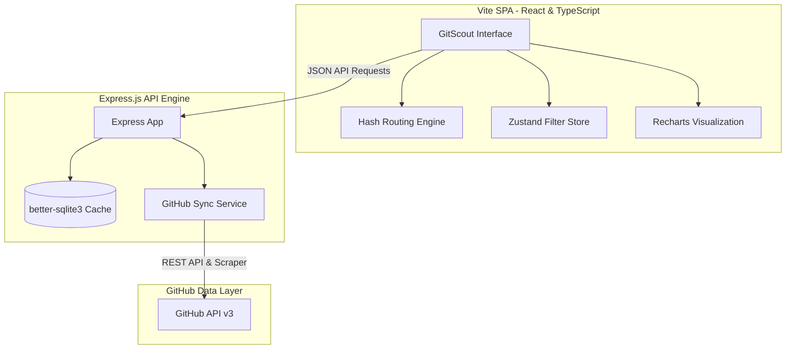

# 🔭 GitScout

[](https://react.dev/)
[](https://www.typescriptlang.org/)
[](https://vite.dev/)
[](https://tailwindcss.com/)
[](https://www.sqlite.org/)

**GitScout** is a premium developer intelligence platform, repository crawler, and contribution opportunity scanner. Designed for solo-builders, open-source maintainers, and developer-engineers, GitScout parses the vast landscape of GitHub to isolate high-value open-source opportunities, evaluate repository health metrics in real time, and map out structured pathways for contribution.

With a high-fidelity dark-tech aesthetic, Geist typography, and fluid micro-interactions, GitScout transforms unstructured repository metadata into structured, actionable development insights.

---

## 🏗️ Architecture Overview

GitScout connects a responsive, lightweight single-page application (SPA) with a resilient SQLite-cached Express API server that actively communicates with the GitHub REST API.



---

## ⚡ Key Capabilities

### 1. Trending Scout (`/trending`)
* **Real-time Discovery**: Tracks trending repositories filtered by modern categories (AI/ML, Web Dev, DevTools, CLI, Mobile, Data, Infra, Security).
* **Granular Controls**: Sort and filter by programming languages, time periods (Today, This Week, This Month), and full-text keyword searches.
* **Velocity Metrics**: Visualizes daily star accretion rates and fork ratios at a glance.

### 2. Opportunity Scanner (`/opportunities`)
Scans and profiles repositories with high potential vectors, classifying them into distinct target opportunities:
* 🔥 **Rising Stars**: Newly created repositories exhibiting aggressive exponential star growth.
* 🐛 **Issue Bounty**: Popular repositories with critical open issues but low contributor bandwidth.
* 💤 **Abandoned Gold**: Widely starred repositories that haven't received updates in 6+ months.
* 🌱 **First PR Friendly**: Ideal starting repositories containing active, triaged `good-first-issue` labels.
* 🎨 **Design & Polish**: Beautiful codebases lacking micro-animations, responsive alignments, or theme calibration.

### 3. Deep Bento Analytics (`/opportunities/:owner/:repo`)
Unfolds an intensive repository health diagnostic screen rendered as a premium bento grid:
* **Commit Activity**: Visualizes 12-month contribution sparklines.
* **Bus Factor**: Computes active developer concentration risks.
* **Issue Ratio Analytics**: Renders interactive circular charts detailing open-to-closed issue ratios.
* **Contribution Guide Generator**: Maps dynamic step-by-step contribution instructions (forking, local building, and targeting good-first-issues).

---

## 📊 Health Score Formula

GitScout uses an opinionated composite scoring algorithm to grade the structural maintenance quality of open-source repositories:

$$\text{Health Score} = \left( C \times 0.25 + R \times 0.20 + M \times 0.20 + D \times 0.15 + F \times 0.10 + P \times 0.10 \right) \times 100$$

Where:
* **$C$ (Commit Frequency)**: Frequency and volume of active commits over the past 12 months.
* **$R$ (Response Speed)**: Median time taken to respond to community issues.
* **$M$ (PR Merge Rate)**: Ratio of merged pull requests against abandoned ones.
* **$D$ (Contributor Diversity)**: Distribution of unique committers to mitigate high bus-factors.
* **$F$ (Release Frequency)**: Recency and regularity of stable tagged releases.
* **$P$ (Community Profile)**: Existence of structural documentation (`README.md`, `CONTRIBUTING.md`, `LICENSE`).

---

## 🛠️ Technology Stack

| Layer | Technology | Purpose |
|---|---|---|
| **Frontend** | React 19, TypeScript, Vite | High-performance SPA with client-side render loops |
| **Styling** | Tailwind CSS v4 | Dark-tech design system built on CSS variable tokens |
| **State** | Zustand | Global atomic filter and theme configurations |
| **Charts** | Recharts, ApexCharts | Mathematical SVG coordinate charts & sparklines |
| **Icons** | Phosphor Icons | Uniform, high-end developer iconography |
| **Backend** | Express.js, TSX | Lightweight API routing for cached data serving |
| **Database** | Better SQLite3 | Embedded schema storage with millisecond response cycles |
| **API Client** | Axios | Live external payload fetching and API requests |

---

## 📂 Project Structure

```
github-scanner/
├── package.json          # Dependency configurations & execution scripts
├── vite.config.ts        # Vite compiler & local proxy configuration
├── tailwind.config.js    # Tailwind layout extensions & theme configuration
├── server/
│   └── index.ts          # Express API server, schema definitions, and seeding vectors
├── src/
│   ├── main.tsx          # Application entrypoint
│   ├── App.tsx           # Router engine and layout container
│   ├── index.css         # Modern typography rules, scrollbars, and HSL tokens
│   ├── components/
│   │   ├── layout/       # Shared Navigation and Footer structures
│   │   ├── trending/     # Trending grid, filters, and cards
│   │   ├── opportunity/  # Opportunity scanner grid and Bento deep analysis
│   │   └── ui/           # Global re-usable components (badges, search, skeletons)
│   ├── stores/
│   │   └── filters.ts    # Zustand store managing routing, themes, and inputs
│   └── types/
│       └── github.ts     # Strong type interfaces for repository data models
```

---

## 🚀 Getting Started

### 📋 Prerequisites
Ensure you have the following installed on your local environment:
* [Node.js](https://nodejs.org/) (v18.0.0 or higher)
* [pnpm](https://pnpm.io/) or [npm](https://www.npmjs.com/)

### 🔌 Setup Environment
To execute real-time synchronization with the GitHub REST API without hitting rate limitations (60 requests/hour for unauthenticated IPs), create a `.env` file in your root directory or export the token:

```bash
GITHUB_TOKEN=your_personal_github_access_token
PORT=3001
```

### 📦 Installation
Clone the repository and install the project dependencies:

```bash
# Install dependencies
pnpm install
```

### 🏃 Running the Application

GitScout requires both the **API Server** and the **Frontend Client** to run concurrently.

1. **Start the API Server**:
   ```bash
   pnpm run server
   ```
   The backend database cache will seed automatically if `gitscout.db` is empty. The server starts at `http://localhost:3001`.

2. **Start the Frontend Client** (in a separate terminal):
   ```bash
   pnpm run dev
   ```
   The application will boot up at `http://localhost:5173`. Open this URL in your browser to interact with the platform.

3. **Production Build**:
   ```bash
   pnpm run build
   ```
   Compiles optimized production bundles for deployment.

---

## 🎨 Design System & Anti-Slop Guidelines

GitScout implements rigid visual constraints to ensure a premium, professional experience for designer-developers:
* **Calibrated Palette**: Warm monochrome dark-mode bases complemented by a single Indigo (`#6366f1`) active accent. Zero purple AI-generated gradients.
* **Geist Typography**: Clean typography using Geist Sans for technical readings and Geist Mono for statistics and code.
* **Subtle Transitions**: Micro-animations on interactive actions (elastic card standard elevation shifts, border refractions, and fade-in entries).
* **Data-First Layouts**: Bento grid structure with clean borders (`border-dark-border`) instead of high-contrast generic cards.
